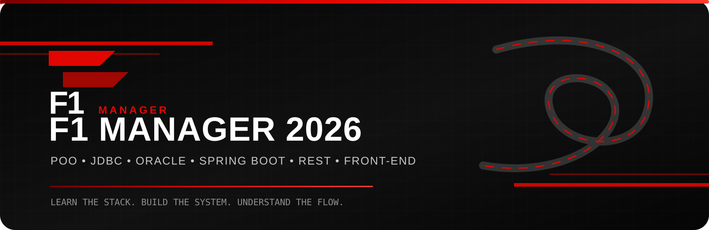
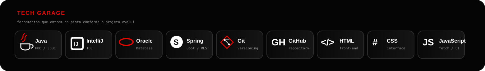
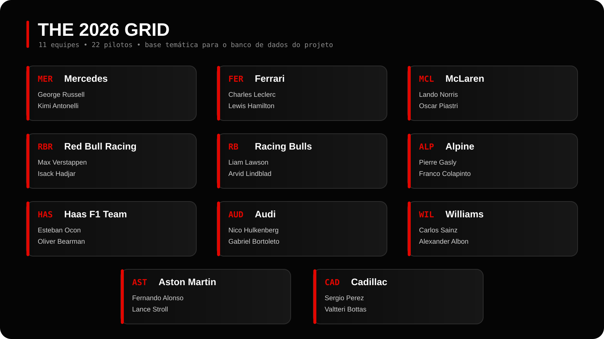

  

Java, Oracle e Spring Boot aplicados em um projeto inspirado na Fórmula 1 2026

Projeto desenvolvido para estudar Programação Orientada a Objetos, JDBC, Banco de Dados, DAO, Service, Controller e API REST de forma prática e progressiva.

 

JAVA   ORACLE   JDBC   SQL   SPRING BOOT   GIT

 

<h2 align="center">Sobre o projeto</h2>

  O <strong>F1 Manager 2026</strong> é um projeto de estudos em Java que simula o gerenciamento de informações de uma temporada de Fórmula 1.
    
  A aplicação começa com os fundamentos de POO e evolui até uma arquitetura com <strong>Controller, Service, DAO e Oracle Database</strong>.

 

O sistema será responsável por trabalhar com:

Pilotos  •  Equipes  •  Grandes Prêmios  •  Resultados  •  Classificação

 

  

<h2 align="center">Tecnologias</h2>

  

Java 21 para POO e regras da aplicação
IntelliJ IDEA como ambiente de desenvolvimento
Oracle Database + SQL para persistência dos dados
JDBC / OJDBC para integração entre Java e Oracle
Spring Boot para Service, Controller e API REST
Git + GitHub para versionamento do projeto

 

  

<h2 align="center">Estrutura da aplicação</h2>

Controller recebe as requisições

↓

Service aplica as regras de negócio

↓

DAO executa as operações no banco

↓

Oracle armazena os dados

 

<h3 align="center">Modelo inicial</h3>

Equipe 1 ───────── N Pilotos

Piloto
├── id
├── nome
├── numero
├── nacionalidade
├── pontos
└── equipe

Equipe
├── id
├── nome
└── pais

 

  

<h2 align="center">Evolução do projeto</h2>

<table align="center">
  <tr>
    <th>Etapa</th>
    <th>Conteúdo</th>
    <th>Status</th>
  </tr>
  <tr><td align="center">01</td><td>POO — Piloto e Equipe</td><td align="center">Em andamento</td></tr>
  <tr><td align="center">02</td><td>Oracle e JDBC</td><td align="center">Próximo</td></tr>
  <tr><td align="center">03</td><td>DAO e CRUD</td><td align="center">Próximo</td></tr>
  <tr><td align="center">04</td><td>Relacionamentos</td><td align="center">Planejado</td></tr>
  <tr><td align="center">05</td><td>Spring Boot</td><td align="center">Planejado</td></tr>
  <tr><td align="center">06</td><td>Service e Controller</td><td align="center">Planejado</td></tr>
  <tr><td align="center">07</td><td>API REST</td><td align="center">Planejado</td></tr>
  <tr><td align="center">08</td><td>Front-end</td><td align="center">Planejado</td></tr>
</table>

 

  O objetivo não é apenas fazer o código funcionar, mas entender <strong>por que cada camada existe e como elas se conectam</strong>.

 

  

<h2 align="center">Grid 2026</h2>

  

  As equipes e pilotos da temporada de 2026 são utilizados como referência para os dados do projeto.

 

  

<h2 align="center">Organização</h2>

f1-manager-2026/
│
├── assets/
├── database/
├── docs/
└── src/
└── br/com/fiap/f1/
├── models/
├── dao/
├── service/
├── controller/
└── tests/

  As pastas são adicionadas conforme cada conceito é estudado e implementado.

 

  

F1 MANAGER 2026

Da orientação a objetos até uma API completa.

 

Desenvolvido por Guilherme Almeida
@guimmalmd

 

Projeto acadêmico e não oficial, criado exclusivamente para estudo de desenvolvimento de software.

